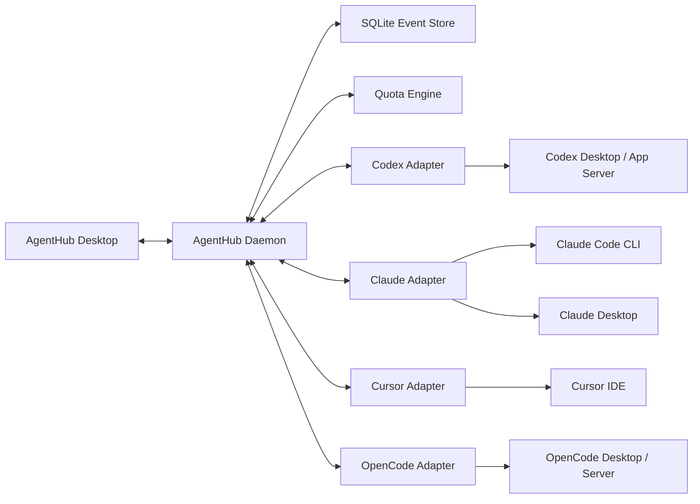

# AgentHub Hybrid Agent Control Center Design

**Status:** Approved
**Date:** 2026-08-11
**Target:** macOS, local-first, single user

## 1. Context

The user runs several AI coding agents concurrently: Codex Desktop, Claude Desktop, Claude Code in a terminal, Cursor IDE, and OpenCode Desktop with an OpenCode Go subscription. Work is split across native desktop applications and terminal sessions. Today, subscription usage, active work, attention requests, and outputs are scattered across those applications.

AgentHub will provide one local desktop control center for:

1. Viewing quota usage and reset times across subscriptions.
2. Listing all known running sessions, background tasks, and subagents.
3. Jumping from an AgentHub row to the corresponding managed or native surface.
4. Handling task-completion notifications, approvals, choices, and input requests in one inbox when safe.
5. Passing selected output and context between sessions without manual copying.

The user is willing to launch or attach new sessions through AgentHub. This is the key reliability boundary: AgentHub-managed sessions receive full lifecycle metadata; independently launched sessions are discovered read-only unless a provider offers a safe attach mechanism.

## 2. Goals and non-goals

### Goals

- Preserve native Codex, Claude, Cursor, and OpenCode workflows where useful.
- Give every AgentHub-launched session a stable AgentHub ID and retain its provider-native ID.
- Normalize provider state without hiding differences in provider capabilities.
- Keep credentials and full transcripts out of the AgentHub database by default.
- Degrade one provider independently when its integration changes or fails.
- Make every approval and cross-agent delivery attributable and auditable.

### Non-goals for the first release

- Replacing the complete chat, editor, diff, or project-management UI of each provider.
- Multi-machine synchronization, mobile clients, or team collaboration.
- Automatic approval of commands or permissions.
- Migrating hidden model state, tool state, or complete native session formats.
- Automatically moving an in-flight task merely because another subscription has more quota.
- A general third-party adapter/plugin SDK. MVP adapters are internal and explicit.

## 3. Approaches considered

### Native application launcher

AgentHub would launch native applications, read local state, and use macOS Accessibility for navigation. This preserves the native experience but cannot reliably centralize approvals, subagent state, or message delivery.

### Fully unified client

AgentHub would host every provider runtime and replace each provider's primary UI. This offers the strongest control but duplicates several complete products and still cannot faithfully replace Cursor IDE or Claude Desktop.

### Hybrid control center — selected

AgentHub owns the lifecycle of new sessions and uses structured provider protocols where available. It retains native desktop surfaces where protocol support is incomplete, and uses hooks, local state, or Accessibility only as explicit fallbacks. Existing tools are reused rather than reimplemented: CodexBar supplies quota data, and ccmux may manage terminal panes without becoming a core dependency.

## 4. Architecture



### Desktop application

A native macOS application presents the session tree, quotas, request inbox, recent output, launch controls, and handoff actions. SwiftUI and AppKit are the preferred implementation because macOS notifications, Keychain, application activation, Accessibility, and helper lifecycle are first-class requirements.

The MVP detail view contains metadata, recent output, pending requests, delivery history, and a basic composer for integrations that support safe input. It is not a full provider chat or code editor.

### Background daemon

A per-user daemon owns adapters, process launches, event normalization, quota refresh, pending-request state, and handoff queues. It continues observing sessions when the dashboard window is closed. The app and daemon communicate over a user-private Unix domain socket. The daemon is packaged with the app and installed as a per-user LaunchAgent.

### Persistence

SQLite stores normalized session metadata, state transitions, pending requests, delivery envelopes, and non-secret audit metadata. Provider-native transcripts remain in provider storage. AgentHub may cache at most three recent visible turns or 256 KiB per session, whichever comes first. The cache is deleted 24 hours after completion and never becomes a complete-history index.

### Adapter boundary

Each adapter implements the same internal operations where supported:

- discover and reconcile sessions;
- launch, attach, stop, and query status;
- stream lifecycle and request events;
- enumerate parent/child relationships;
- read up to 20 selected recent user-visible turns on demand;
- submit input or resolve a request;
- produce a jump target;
- report capability and health changes.

Provider-specific raw payloads do not leak into the UI. The normalized record retains an opaque provider reference for diagnostics and exact response routing.

## 5. Reliability levels and provider coverage

Every capability is labeled independently; an adapter is not assigned one blanket reliability level.

| Level | Meaning | Allowed behavior |
|---|---|---|
| L1 | Provider-native structured protocol | Read and mutate through provider IDs and acknowledged requests |
| L2 | Hooks, managed process, PTY, or documented local state | Observe reliably; mutate only after validating current state |
| L3 | macOS application activation or Accessibility | Navigate or assist the user; never silently approve or submit |

Initial provider strategy:

| Surface | Primary integration | Expected level |
|---|---|---|
| Codex managed sessions | Codex App Server | L1 for session state, child threads, turns, approvals, input, and quota |
| Codex Desktop | Native/local discovery plus app activation | L2 discovery, L3 navigation when direct routing is unavailable |
| Claude Code CLI | Lifecycle hooks, transcript references, managed PTY or ccmux | L2 |
| Claude Desktop | Local discovery and app activation | L2 discovery, L3 navigation/control |
| OpenCode managed/Desktop sessions | OpenCode HTTP server and event stream | L1 |
| Cursor IDE | CLI hooks where applicable, local session metadata, app activation | L2 discovery, L3 navigation/control |
| Subscription quota | CodexBar CLI or local service output | L1/L2 according to CodexBar source freshness |

The UI shows capability badges and degradation messages. It never presents L3 behavior as a guaranteed native operation.

## 6. Unified session and agent model

```text
ProviderAccount
└── AgentSession
    ├── RuntimeHandle
    ├── PendingRequest[]
    └── AgentNode[]
        └── AgentNode[]
```

### ProviderAccount

Identifies a quota and authentication scope without storing its secret. It contains provider, stable local account key, display label, plan metadata, and Keychain references.

### AgentSession

Contains:

- AgentHub ID and provider-native session ID;
- provider account and Desktop/CLI surface;
- managed or discovered ownership;
- title, repository, working directory, and Git branch;
- parent, root, and provider ancestry identifiers;
- normalized status and last activity time;
- jump target and per-capability reliability levels;
- recent-output preview capped at three turns or 256 KiB;
- associated quota account.

### AgentNode

Represents a background task or subagent. Nodes may be nested. A node records provider-native ID, parent ID, type, status, runtime, last activity, and optional transcript reference. When the provider does not expose parentage, AgentHub does not infer it; the session is shown separately with a “relationship unknown” marker.

### RuntimeHandle

Records how AgentHub can observe or control a live surface: provider connection, child process, PTY, tmux pane, application/window reference, or read-only discovery reference. Runtime handles are ephemeral and are reconciled after daemon restart.

### Status model

```text
starting -> working -> waiting_permission
                    -> waiting_input
                    -> idle -> working
                    -> completed
                    -> error
any live state -> disconnected
```

`disconnected` means the control channel is unavailable, not that work finished. Historical transcript presence alone never counts as running. A running classification requires a live managed process, a provider-native active state, or a recent event plus an observable runtime.

### Deduplication and display

- Provider-native session ID is the primary deduplication key within an account.
- Multiple observations of the same session merge rather than create duplicate rows.
- Claude Desktop and Claude Code sessions under the same account remain separate sessions.
- Background tasks and subagents are nested under their parent instead of mixed with top-level sessions.
- The dashboard defaults to “Running” and “Recently completed”; recent completions remain visible for 24 hours. Older sessions remain searchable.

### Jump behavior

Clicking a row selects the strongest current jump mechanism:

1. provider-native route or managed AgentHub detail view;
2. managed terminal/PTY/tmux pane;
3. activate the native app and select a known window;
4. optional Accessibility navigation;
5. if none is safe, open the AgentHub detail view and explain the limitation.

## 7. Notification and request center

### PendingRequest types

```text
permission
plan_approval
choice
text_input
confirmation
authentication
```

A request stores AgentHub ID, provider request ID, session and turn references, type, display payload, allowed actions, creation and expiry time, capability level, and resolution state. Sensitive input values are never persisted.

### Request flow

1. An adapter receives a provider event.
2. The daemon deduplicates by provider request ID and persists the normalized request.
3. AgentHub updates badges and optionally posts a macOS notification.
4. The user responds in AgentHub or jumps to the native application.
5. The adapter routes the exact response to the originating request.
6. Provider acknowledgement changes the request to resolved; cancellation or timeout changes it to expired.

### Safety rules

- L1 requests may be answered directly from AgentHub.
- L2 requests may be answered only when the target is still waiting and the current prompt fingerprint matches the recorded request.
- L3 requests only activate and navigate to the source application.
- Authentication, passwords, and verification codes are completed in the native provider surface.
- A provider-side resolution disables stale AgentHub actions immediately.
- MVP has no automatic approval policy. A later explicit allowlist may be designed separately; destructive operations are never silently approved.
- Audit data records actor, request type, time, session, decision, and outcome, but excludes credentials and full sensitive output.

Notifications can be muted by provider, project, or event type. Attention requests outrank completion notices. AgentHub can suppress its own duplicate notification when the provider already displayed one, but it does not alter provider settings without user action.

## 8. Cross-agent handoff

### MessageEnvelope

```text
id
sourceSession / targetSession
sourceProvider / targetProvider
repo / cwd / branch
selectedTurns
lastResponse
diffSummary / artifactPaths
userNote
createdAt / expiresAt
deliveryState / acknowledgement
```

The default handoff contains the final visible response, repository and branch context, provenance, and an optional user instruction. The user may explicitly select up to 20 recent turns. Complete session history is not copied by default.

### Delivery rules

- An idle target receives the envelope immediately.
- A working target queues the envelope until its current turn ends.
- A target with a pending request rejects automatic delivery so the request cannot be overwritten.
- L1 uses the provider input endpoint and waits for acknowledgement.
- L2 uses a managed PTY or hook only after validating that the target composer is idle.
- L3 copies a rendered envelope to the clipboard and jumps to the target; it does not paste or submit automatically.
- Failed envelopes remain visible and can be retried or copied manually.
- The receiving agent is told the source session, provider, project, branch, and creation time.

MVP transfers visible, auditable context only. It does not claim to transfer hidden model context, provider permissions, or tool state.

## 9. Quota collection and routing

CodexBar is the initial quota acquisition layer. AgentHub consumes its machine-readable output and does not duplicate browser-cookie, OAuth, or provider-specific scraping logic.

### QuotaWindow

```text
provider / account
usedPercent
windowDuration
resetsAt
fetchedAt
freshness
source
```

Each provider can expose several windows, such as five-hour, weekly, or monthly usage. A source-provided TTL controls freshness when available; otherwise data becomes stale 15 minutes after its last successful fetch. Stale data is excluded from recommendations.

For a window:

```text
remaining quota fraction = 1 - usedPercent
remaining time fraction = (resetsAt - now) / windowDuration
available pace = remaining quota fraction / remaining time fraction
```

The tightest applicable window bounds the account. This score is not compared alone. Routing first applies capability and task-fit constraints, then considers available pace, predicted consumption from local session history, queue length, project locality, reset proximity, and handoff cost.

MVP provides two recommendations:

- a provider/account suggestion when creating a new task;
- a handoff suggestion when the current account approaches a quota boundary.

Recommendations explain their inputs and uncertainty. They never automatically move an active task or prefer quota over task suitability. Providers without verified quota data remain available for manual selection but do not receive a quota-based advantage.

## 10. MVP user experience

The first release includes:

- a quota strip with usage, reset time, freshness, and recommendation explanations;
- a running/recent session tree with provider, project, status, capability, and subagent nesting;
- launch controls for managed sessions;
- a unified request inbox and macOS notifications;
- click-to-jump with explicit fallback messaging;
- a detail pane with metadata, recent output, requests, deliveries, and a basic supported-provider composer;
- manual handoff of the last response or up to 20 recent turns;
- adapter health and degradation indicators.

Implementation order is Codex App Server, OpenCode Server, Claude Code CLI, quota integration, then read-only discovery and navigation for Codex Desktop, Claude Desktop, and Cursor IDE. This order delivers reliable core behavior before optional Accessibility work.

## 11. Failure handling

- Adapters reconnect with jittered exponential backoff from one second up to a 60-second ceiling and expose health transitions.
- Daemon restart rehydrates persisted state, then reconciles provider sessions and live processes before emitting final status.
- A session that cannot be verified becomes `disconnected` with a verification-unavailable reason rather than `completed`.
- Pending requests and handoff envelopes use idempotency keys so retries do not duplicate provider actions.
- Provider schema or parser failures disable only the affected adapter capability.
- Quota refresh failure preserves the last value as stale rather than replacing it with zero.
- Accessibility permission is optional. Without it, discovery remains available and exact native-app jumping is disabled.
- Daemon crashes do not terminate provider processes unless AgentHub explicitly owns a child process configured to terminate with the daemon; the default is to preserve work.

## 12. Security and privacy

- The daemon accepts connections only over a per-user Unix socket with restrictive permissions.
- OAuth tokens, browser credentials, API keys, and provider secrets are stored in or referenced through macOS Keychain.
- SQLite and cached previews use user-only filesystem permissions.
- Full transcripts remain in provider storage by default.
- Handoffs show a preview and destination before delivery.
- Approval actions are bound to exact provider request IDs and session/turn references.
- Accessibility is requested only for features that require it and is never a prerequisite for basic monitoring.
- Diagnostics redact credentials, cookies, environment secrets, and sensitive request fields.

## 13. Testing strategy

### Unit tests

- normalized state transitions;
- session deduplication and parent/child assembly;
- pending-request idempotency, expiry, and race resolution;
- handoff queue eligibility and rendering;
- quota freshness, available-pace calculation, and routing constraints;
- secret redaction.

### Adapter contract tests

Every adapter runs against recorded, sanitized protocol fixtures and must demonstrate discovery, lifecycle mapping, disconnection, request resolution where supported, output reads capped at 20 selected turns, and unsupported-capability reporting.

### Integration tests

- fake Codex and OpenCode servers exercise reconnect and acknowledgement flows;
- managed Claude CLI fixtures exercise hooks and PTY state validation;
- daemon restart tests verify reconciliation and persisted queues;
- CodexBar fixtures verify multi-window and stale quota handling;
- macOS application tests verify activation and Accessibility-disabled fallback behavior.

Live provider tests are opt-in and never run in normal CI because they can consume subscription quota or mutate real sessions.

## 14. Acceptance criteria

- Every AgentHub-launched session appears once and retains stable identity across daemon restart.
- Provider-exposed subagents are nested under the correct parent.
- One provider failure does not interrupt other adapters or the dashboard.
- The same provider request cannot notify or resolve twice.
- L1 approval decisions are acknowledged by the originating provider request.
- A handoff to a working target stays queued and delivers only after the target is idle.
- A handoff never overwrites a pending request or non-empty unmanaged composer.
- Stale or unverifiable quota data cannot drive an automatic recommendation.
- The UI shows whether each action is L1, L2, or L3 and explains unavailable actions.
- Daemon restart preserves pending requests and delivery records and reconciles them before enabling actions.
- Disabling Accessibility leaves monitoring, quotas, and L1/L2 functionality usable.

## 15. External foundations

- [OpenAI Codex App Server documentation](https://developers.openai.com/codex/app-server)
- [Claude Code hooks reference](https://code.claude.com/docs/en/hooks)
- [OpenCode server documentation](https://dev.opencode.ai/docs/server/)
- [CodexBar](https://github.com/steipete/CodexBar)
- [ccmux](https://github.com/epilande/ccmux)
