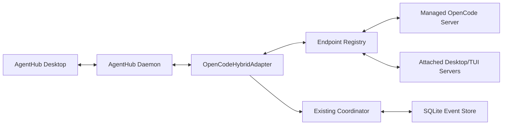

# AgentHub Hybrid OpenCode Integration Design

**Status:** Approved interactively; pending written-spec review
**Date:** 2026-08-11
**Target:** Plan 2 of the AgentHub delivery roadmap
**Validated against:** OpenCode 1.18.10 on macOS

## 1. Context

The AgentHub Codex vertical slice is complete. The next provider integration must support both ways the user runs OpenCode:

1. sessions launched and owned by AgentHub; and
2. sessions already running in OpenCode Desktop or an OpenCode TUI.

OpenCode exposes a local HTTP API and server-sent event stream. A single server can address multiple project directories by using the `directory` query parameter. This makes a hybrid adapter possible without starting one daemon per repository.

The selected design is one `OpenCodeHybridAdapter` backed by an endpoint registry. Managed and attached endpoints are normalized into the existing AgentHub session, request, handoff, and jump abstractions. OpenCode Go quota aggregation remains out of scope for this plan and will be implemented in the quota roadmap stage.

Official reference: [OpenCode Server documentation](https://opencode.ai/docs/server/).

## 2. Goals and non-goals

### Goals

- Lazily start a private AgentHub-managed OpenCode server when the first managed OpenCode session is launched.
- Discover current-user OpenCode Desktop and TUI servers without scanning arbitrary ports.
- Let the user attach a loopback server manually when automatic discovery cannot resolve it.
- Merge duplicate observations of the same OpenCode session across endpoints.
- Show sessions, child sessions, recent output, state, permissions, and questions in the existing dashboard.
- Launch OpenCode work, submit messages, resolve requests, perform cross-agent handoffs, and jump to the strongest available native surface.
- Recover deterministically from daemon restarts, server restarts, SSE disconnects, and first-responder permission races.
- Keep server credentials out of SQLite and avoid consuming OpenCode Go quota in default tests.

### Non-goals

- OpenCode Go quota or subscription recommendation logic.
- Connecting to non-loopback or remote OpenCode servers.
- Replacing the complete OpenCode Desktop or TUI interface.
- Taking ownership of an independently launched OpenCode process.
- Automatically approving permissions.
- Migrating complete transcripts into AgentHub.
- Depending on undocumented OpenCode storage formats when a structured HTTP API is available.

## 3. Selected architecture



### OpenCodeHybridAdapter

One provider adapter owns all OpenCode behavior. It:

- maintains one optional managed endpoint and zero or more attached endpoints;
- reconciles snapshots with live SSE events;
- converts OpenCode sessions, child sessions, messages, permissions, and questions into existing normalized models;
- resolves a runtime route for every read or mutation;
- exposes capability health independently from other providers.

Keeping one adapter avoids separate managed/Desktop/TUI implementations that would duplicate deduplication and request logic. Endpoint origin remains visible as runtime metadata, not as session identity.

### Endpoint registry

Each endpoint record contains:

```text
endpointID
origin: managed | desktop | tui | manual
baseURL
processIdentity?
credentialReference?
health/version/lastSeen
knownDirectories
capabilities
```

The registry owns health probes, authentication state, SSE connections, backoff, and removal of stale attached endpoints. Endpoint records are runtime observations and may change without changing an AgentHub session ID.

### Existing AgentHub services reused

- `Coordinator` remains the authority for normalized sessions and requests.
- The SQLite store persists normalized state and non-secret routing hints.
- Existing request-resolution and message-delivery services route through the OpenCode adapter.
- The SwiftUI dashboard consumes the same IPC snapshots and actions used by Codex, extended only where OpenCode has provider-specific choices.

## 4. Endpoint lifecycle and security

### Managed endpoint

The daemon starts `opencode serve` only when a user first launches an OpenCode task. The process then lives with the AgentHub daemon and serves multiple repositories.

Launch requirements:

- bind only to `127.0.0.1`;
- allocate an available random port;
- generate a random Basic Auth password for each process lifetime;
- pass the password through the child environment rather than command-line arguments;
- inherit the user's normal OpenCode configuration and subscription;
- do not use `--pure` in production;
- capture structured logs with secrets redacted;
- terminate the child when the daemon exits normally.

The managed password stays in daemon memory. Restarting the daemon or server rotates it. The endpoint is ready only after `GET /global/health` reports a healthy response and a version.

If the child exits unexpectedly, AgentHub marks only OpenCode managed capabilities disconnected and restarts with exponential backoff from 1 to 60 seconds. After recovery it reconciles snapshots before processing new live events.

### Automatic attached-endpoint discovery

Discovery is constrained to the current macOS user:

1. enumerate OpenCode Desktop and `opencode` processes owned by the current user;
2. inspect loopback listening sockets belonging to those process trees;
3. probe only those resolved sockets with `GET /global/health`;
4. accept an endpoint only when the response identifies a healthy OpenCode server;
5. periodically revalidate process identity, socket ownership, and health.

AgentHub does not scan a port range and does not probe unrelated listeners. A process exit or repeated failed ownership/health validation removes the runtime endpoint after a short grace period while preserving historical sessions.

### Manual endpoint fallback

Settings accepts only `http://127.0.0.1:<port>` or the IPv6 loopback equivalent in this plan. The same health verification applies. Remote hosts, wildcard hosts, TLS exceptions, and SSH tunnels are rejected as out of scope.

If the endpoint returns `401`, AgentHub creates an `authentication` request. The user-provided password is stored in macOS Keychain. SQLite stores only an opaque Keychain reference. Passwords are excluded from logs, IPC payloads, database records, and UI diagnostics.

### Trust boundary

Attached endpoints remain owned by their native OpenCode process. AgentHub may use their structured API, including resolving requests, only while the endpoint is healthy and the target request is still pending. AgentHub never kills or restarts attached processes.

## 5. Stable identity, deduplication, and routing

The canonical provider key is:

```text
provider = openCode
account = local-default
nativeID = ses_...
```

The endpoint URL and port are deliberately absent from identity. OpenCode session IDs are therefore stable when a Desktop/TUI server restarts or when the same session becomes visible through more than one endpoint.

### Merge rules

- Observations with the same provider account and native session ID merge into one `AgentSession`.
- Runtime routes are retained as a set ordered by current fitness.
- The freshest structured state wins; equal timestamps prefer an active state over a disconnected observation.
- Child sessions use their OpenCode `parentID` and map to `AgentNode` ancestry.
- Missing parentage is not inferred from titles or directories.
- Recent output is deduplicated by OpenCode message/part IDs before applying the existing cache limits.

### Route selection

For reads and commands, the adapter selects a healthy endpoint that currently exposes the session and matches its directory. Managed sessions prefer the managed endpoint. Attached sessions prefer their observed endpoint. If several endpoints qualify, the freshest successful route wins.

For jump actions, a Desktop/TUI-origin route is preferred because it can expose the native surface. Runtime route changes update ephemeral routing state without producing a new session row.

All mutations revalidate endpoint health and the target resource immediately before sending. The adapter returns an explicit stale-route error instead of falling through to a different session or directory.

## 6. Validated OpenCode API contract

The implementation targets the non-`/api` routes exposed by the locally installed OpenCode 1.18.10 OpenAPI document. The public server documentation is the external compatibility reference. Unknown fields and unknown SSE event types must decode without taking down the adapter.

| Purpose | Method and route | Required behavior |
|---|---|---|
| Verify endpoint | `GET /global/health` | Require `healthy: true`; record version |
| List/create sessions | `GET /session`, `POST /session` | Include `directory` when scoped to a repository |
| Read session | `GET /session/{sessionID}` | Reconcile canonical metadata |
| Session status | `GET /session/status` | Normalize active/idle/error state |
| Child sessions | `GET /session/{sessionID}/children` | Preserve `parentID` hierarchy |
| Recent messages | `GET /session/{sessionID}/message` | Fetch at most 20 for AgentHub previews/handoffs |
| Submit input | `POST /session/{sessionID}/prompt_async` | Send `parts`; expect `204`; pass `directory` |
| Subscribe | `GET /event` | Parse `text/event-stream`, reconnect with backoff |
| Pending permissions | `GET /permission` | Rebuild inbox after connect/reconnect |
| Resolve permission | `POST /permission/{requestID}/reply` | Body `reply: once | always | reject`, optional `message` |
| Pending questions | `GET /question` | Rebuild choice/text requests after reconnect |
| Answer question | `POST /question/{requestID}/reply` | Body `answers: QuestionAnswer[]` |
| Native navigation | `POST /tui/select-session` | Body `sessionID`; exact selection when supported |

`directory` and `workspace` are optional query parameters on the validated session, event, permission, question, and TUI operations. AgentHub uses `directory` for the initial implementation and preserves room for future workspace support.

No implementation assumes that a successful HTTP request means the local view is already reconciled. Mutations use the HTTP acknowledgement, then converge through the subsequent snapshot/event state.

## 7. Data flows

### Launch a managed OpenCode task

1. The desktop sends a launch action with repository, initial instruction, and optional OpenCode agent/model choices.
2. The adapter starts and health-checks the managed endpoint if it is absent.
3. It calls `POST /session?directory=...` and records the returned `ses_...` ID.
4. It calls `POST /session/{sessionID}/prompt_async?directory=...` with text parts.
5. The coordinator persists the normalized session and exposes it immediately as starting/working.
6. SSE events and snapshot reconciliation update messages, state, children, and requests.

If session creation succeeds but prompt submission fails, the empty session remains visible with a retryable delivery error. AgentHub does not silently create a second session.

### Initial and reconnect reconciliation

For each healthy endpoint, reconciliation reads:

- sessions and status;
- child sessions for relevant roots;
- a bounded recent-message window for visible/recent sessions;
- all pending permissions;
- all pending questions.

The adapter applies a snapshot transaction, then begins or resumes SSE consumption. On an SSE disconnect it marks stream freshness degraded, reconnects with bounded exponential backoff, performs another reconciliation, and only then treats new events as authoritative. This closes event gaps without persisting an unbounded event cursor.

### Live events

The SSE decoder recognizes session, status, message/part, child-session, permission, and question event families. Known events become idempotent coordinator updates. Unknown events are logged by type at debug level and ignored. A malformed individual event does not terminate the stream unless framing itself is unrecoverable.

### Permission resolution

OpenCode permissions appear in the unified inbox with `Once`, `Always`, and `Reject` actions. AgentHub may answer directly because this is an L1 structured route.

Resolution uses first-responder semantics: OpenCode Desktop, TUI, or AgentHub may answer first. Before posting, AgentHub verifies that the request remains pending. A success resolves it. A not-found or already-resolved response triggers immediate reconciliation and converges to the provider state rather than showing a false failure. Duplicate local clicks are suppressed while a reply is in flight.

### Question response

OpenCode question items normalize to existing `choice` or `text_input` requests. AgentHub preserves question order and submits `QuestionAnswer[]` in that order. The response control is disabled after submission until acknowledgement/reconciliation. Sensitive free-text input is not persisted.

### Cross-agent handoff

The existing handoff service builds a `MessageEnvelope`, resolves the target OpenCode runtime route, and sends the rendered envelope through `prompt_async`. A working target keeps the envelope queued until its current turn is idle; a target with a pending request rejects automatic delivery. Provider acknowledgement updates delivery state, and SSE/message reconciliation confirms visible arrival.

### Click-to-jump

For a session with a healthy Desktop/TUI route, AgentHub calls `POST /tui/select-session`, then activates the owning application or terminal. If exact selection is unavailable, AgentHub activates OpenCode and opens its session picker when possible. If neither is safe, it opens AgentHub detail and displays a clear degraded-navigation message. It never claims exact navigation after a fallback.

## 8. Persistence and IPC changes

### Persistence

Add only normalized, non-secret data required for recovery:

- provider-native OpenCode session and request IDs;
- endpoint origin and non-secret last-known routing hints;
- discovered directory and native-surface metadata;
- OpenCode request action choices and provider acknowledgement state;
- Keychain credential reference for a manual endpoint;
- endpoint health/version timestamps for diagnostics.

Endpoint passwords, Basic Auth headers, full transcripts, raw SSE payload archives, and question free-text answers are not stored.

### IPC

Extend existing messages rather than adding an OpenCode-only transport:

- launch request gains provider plus optional provider-specific agent/model selection;
- session snapshots gain `surface` (`managed`, `desktop`, `tui`, `manual`) and OpenCode capability state;
- request snapshots can expose provider-defined display actions while retaining normalized request types;
- settings actions can list, attach, authenticate, and detach manual OpenCode endpoints;
- jump and handoff actions continue using stable AgentHub session IDs.

IPC validation rejects credential values in persisted settings payloads and rejects a route whose session/directory no longer matches.

## 9. Desktop UI

### New Task

The New Task sheet adds a provider selector. Choosing OpenCode exposes repository/directory, initial instruction, and optional agent/model controls. The default choice uses OpenCode defaults rather than hard-coding a Go model.

### Session tree and detail

- OpenCode rows use the same status model as Codex.
- A surface badge distinguishes Managed, Desktop, TUI, and Manual attachment.
- Child OpenCode sessions nest under their provider parent.
- Detail shows endpoint health, recent output, requests, and delivery history without exposing credentials.
- One merged session row may list more than one available surface.

### Request inbox

- Permission cards show `Once`, `Always`, and `Reject`.
- Question cards render single/multiple-choice or free-text controls according to the provider payload.
- Resolved elsewhere removes or disables actions immediately after reconciliation.
- Authentication cards open a secure password sheet backed by Keychain.

### Settings and quota

Settings shows managed-server health, discovered endpoints, and manual loopback attachments. It explains discovery/authentication failures without displaying secrets.

OpenCode quota is shown as unavailable in this plan. The dashboard must not fabricate a percentage, reset time, or routing recommendation. OpenCode Go usage is deferred to the unified quota implementation.

## 10. Failure handling and degradation

| Failure | Behavior |
|---|---|
| Managed binary missing | Disable managed launch, keep attached discovery active, show actionable path/version diagnostic |
| Managed server crashes | Mark managed routes disconnected, restart with 1–60 second backoff, reconcile |
| Attached process exits | Remove runtime route after grace period; preserve historical session |
| Endpoint returns 401 | Create authentication request; do not repeatedly prompt or log credentials |
| SSE disconnects | Mark freshness degraded, reconnect, snapshot-reconcile, resume events |
| Unknown API field/event | Preserve compatibility by ignoring unknown content and retaining known fields |
| Permission answered elsewhere | Reconcile and mark resolved; no duplicate-error toast |
| Route no longer owns session | Reject mutation as stale and reconcile; never redirect by title/path alone |
| TUI selection unsupported | Activate native app/session picker and label navigation as degraded |
| One OpenCode endpoint is unhealthy | Other endpoints and all non-OpenCode providers continue operating |

Provider health and capability degradation are visible but non-modal unless a requested action cannot proceed.

## 11. Privacy and observability

- All network traffic in this plan remains on loopback.
- Credentials use Keychain or ephemeral daemon memory.
- Logs contain endpoint IDs and response classes, not Authorization headers, prompts, transcript text, or answers.
- Recent-output storage follows the existing three-turn/256 KiB/24-hour limits.
- Manual detach deletes the stored Keychain item after user confirmation and leaves historical normalized sessions intact.
- Diagnostics report the OpenCode version, endpoint origin, health timing, and last error category.
- Audit records identify request, decision, actor, and result without storing sensitive response contents.

## 12. Testing strategy

### Protocol unit tests

- Encode every required HTTP request, including `directory` and Basic Auth.
- Decode session, status, child, bounded message, permission, and question payloads.
- Parse fragmented and multi-event SSE frames.
- Ignore unknown JSON fields and unknown event types.
- Map OpenCode states and request choices into normalized AgentHub models.
- Verify redaction and that credentials never enter SQLite/IPC snapshots.

### Multi-endpoint integration tests

Use deterministic fake loopback servers to cover:

- discovery verification and manual attachment;
- authentication success/failure;
- duplicate session merging across managed/Desktop/TUI endpoints;
- route selection by session and directory;
- snapshot-before-stream reconciliation and SSE reconnect gaps;
- permission/question first-responder races;
- handoff acknowledgement and stale-route rejection;
- exact jump and degraded jump behavior;
- isolation when one endpoint fails.

### Managed-process tests

A fake `opencode` executable verifies lazy launch, loopback/random-port arguments, environment-based password delivery, health readiness, crash restart/backoff, and daemon shutdown cleanup. Tests must prove the production launcher does not pass `--pure`.

### Opt-in live test

The live test uses temporary isolated OpenCode configuration directories and starts `opencode serve --pure` only for test isolation. It verifies health plus create/read/delete session operations. It sends no prompt, selects no paid model, and consumes no OpenCode Go inference quota. The test is skipped by default and requires an explicit environment flag.

### UI tests

- Launch sheet provider selection and OpenCode fields.
- Mixed Codex/OpenCode tree, merged surfaces, and nested children.
- Permission, question, and authentication request cards.
- Manual endpoint validation errors.
- Quota-unavailable and degraded-navigation messaging.

## 13. Acceptance criteria

This plan is complete when all of the following are demonstrated:

1. AgentHub lazily launches a secure loopback OpenCode server and creates a task in a selected directory.
2. AgentHub discovers at least one current-user Desktop/TUI server through process-owned sockets and supports manual loopback attachment.
3. The same `ses_...` observed on multiple endpoints appears once with correct surfaces and routing.
4. Sessions, child sessions, status, and bounded recent output survive daemon restart through reconciliation.
5. Permissions and questions can be answered from AgentHub, including a race where OpenCode answers first.
6. An envelope can be delivered from an existing Codex session to an idle OpenCode session with acknowledgement.
7. Clicking a TUI-backed row selects that session when supported and reports an explicit fallback otherwise.
8. Managed-server crash and SSE disconnect tests recover without affecting Codex.
9. Default tests make no paid OpenCode prompt and all credentials/privacy assertions pass.
10. The packaged app and per-user daemon pass the existing regression suite plus the new OpenCode suite.

## 14. Rollout

The adapter ships behind an OpenCode capability flag during development. Rollout order is:

1. protocol client, models, and fake-server contract tests;
2. managed endpoint lifecycle and managed-session vertical slice;
3. attached discovery, manual authentication, and deduplication;
4. permissions, questions, handoff, and navigation;
5. UI polish, restart recovery, live compatibility check, packaging regression.

If installed OpenCode compatibility is outside the validated API surface, AgentHub disables only the affected operation, shows the detected version and failure, and retains safe read-only behavior where possible. OpenCode Go quota support remains a separate roadmap deliverable.
