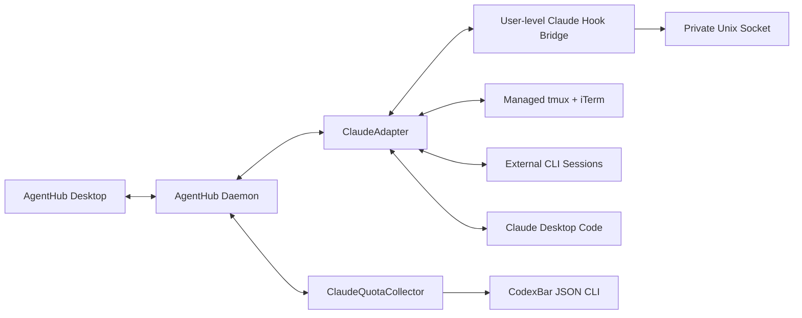

# AgentHub Hybrid Claude Integration Design

**Status:** Approved
**Date:** 2026-08-12
**Target:** Claude provider delivery after the Codex and OpenCode vertical slices
**Validated against:** Claude Code 2.1.228 on macOS

## 1. Context

AgentHub currently manages Codex and OpenCode sessions through a native macOS
dashboard and a user-scoped daemon. The next provider slice must cover both ways
the user runs Claude Code:

1. visible Claude Code CLI sessions in a terminal; and
2. local Claude Code sessions in the Code tab of Claude Desktop.

The user wants all future Claude sessions, including sessions launched outside
AgentHub, to appear in the session tree and unified request inbox. The user has
approved a user-level Claude hook configuration and optional macOS Accessibility
permission. AgentHub-launched sessions must remain visible in the native Claude
TUI rather than being replaced by a background `stream-json` client.

Claude Code exposes structured lifecycle hooks but not a supported local session
control API for interactive CLI or Desktop sessions. The selected design
therefore combines structured hooks with a managed terminal runtime. Managed CLI
sessions receive L2 control through a known tmux pane. Independently launched
CLI and Desktop sessions use structured observation plus validated L3 navigation
or interaction fallbacks.

Claude subscription quota is part of this delivery. AgentHub reuses CodexBar's
machine-readable Claude usage output instead of reading Claude credentials or
calling an undocumented Anthropic endpoint itself.

Official references:

- [Claude Code hooks](https://code.claude.com/docs/en/hooks)
- [Claude Code Desktop](https://code.claude.com/docs/en/desktop)
- [Claude Code session management](https://code.claude.com/docs/en/sessions)
- [Claude Code deep links](https://code.claude.com/docs/en/deep-links)
- [CodexBar CLI](https://github.com/steipete/CodexBar/blob/main/docs/cli.md)

## 2. Goals and non-goals

### Goals

- Launch AgentHub-owned Claude Code sessions in a visible iTerm window backed by
  tmux, with a stable Claude session UUID and AgentHub runtime identity.
- Discover future independently launched Claude CLI and local Claude Desktop
  Code sessions through user-level hooks.
- Normalize lifecycle, recent visible output, permissions, choices, questions,
  subagents, and background tasks into existing AgentHub models.
- Preserve native handling while allowing AgentHub to answer a request only when
  the exact native surface and current prompt can be verified.
- Jump to the exact managed tmux session and attempt validated navigation to an
  external terminal or Claude Desktop session.
- Deliver cross-agent handoffs directly to an idle managed CLI session; use a
  clipboard-and-jump fallback for unmanaged CLI and Desktop targets.
- Show Claude subscription windows, reset times, freshness, pace, account, and
  plan through CodexBar JSON.
- Preserve current privacy limits and isolate Claude failures from other
  providers.

### Non-goals

- Replacing the Claude TUI or Claude Desktop Code interface.
- Controlling Claude cloud, SSH, web, Remote Control, Cowork, or Dispatch
  sessions.
- Treating local transcripts as proof that a session is running.
- Automatically approving permissions or enabling bypass-permission modes.
- Automatically pasting or submitting handoffs to unmanaged CLI or Desktop
  sessions.
- Merging distinct CLI and Desktop histories by title, repository, or time.
- Reading or persisting Claude OAuth tokens, browser cookies, passwords, or
  verification codes in AgentHub.
- Bundling the third-party CodexBar binary in the AgentHub repository.

## 3. Selected architecture



### ClaudeHookInstaller

The installer owns only AgentHub hook entries in the user's Claude settings. It
parses the existing JSON, merges hook commands with absolute paths into a copy,
validates the result, and atomically replaces the file. Existing hooks, settings,
formatting-independent values, and unknown keys are preserved. Reinstall is
idempotent. Uninstall removes only hook commands whose normalized executable path
matches the AgentHub hook bridge and leaves every other entry unchanged.

The initial implementation uses standalone user settings instead of publishing a
Claude marketplace. This avoids a network-distributed plugin lifecycle for one
local application while retaining the same supported hook contract. A managed
Claude policy that disallows user hooks produces a visible capability degradation
and is never bypassed.

### ClaudeHookBridge

The bridge is a small executable packaged with AgentHub. Claude invokes it with a
JSON payload on stdin. It validates the event name and payload size, adds local
process ancestry metadata without copying environment variables, sends the event
over the user-private AgentHub Unix socket, and exits quickly.

Lifecycle hooks run asynchronously where the provider permits it. The
`PermissionRequest` observer also reports asynchronously and returns no decision,
so Claude continues to its native prompt. AgentHub request actions operate on a
separately verified native runtime; the hook does not hold Claude open while the
user decides.

Events used by the first slice are:

- `SessionStart`, `SessionEnd`, `UserPromptSubmit`, `Stop`, and `StopFailure`;
- `PreToolUse`, `PostToolUse`, `PermissionRequest`, and `PermissionDenied`;
- `Notification`;
- `SubagentStart`, `SubagentStop`, `TaskCreated`, `TaskCompleted`, and
  `TeammateIdle`;
- `CwdChanged` when available.

Unknown hook events and fields are ignored without disabling known behavior.

### ClaudeAdapter

One adapter normalizes CLI and Desktop observations into existing
`AgentSession`, `AgentNode`, `PendingRequest`, `RecentTurn`, capability, health,
and handoff abstractions. It holds ephemeral routes for managed tmux, external
terminal, and Desktop surfaces. Provider-specific payloads remain behind the
adapter boundary.

The canonical provider key is:

```text
provider = claude
account = resolved Claude account or local-default
nativeID = Claude session UUID
surface = managedCLI | externalCLI | desktop
```

CLI and Desktop session histories remain separate even when they use the same
Claude account and repository. Exact provider session ID is the only automatic
deduplication key within an account and surface family.

### ClaudeTerminalRuntime

The current machine provides tmux and iTerm. For a managed launch, the daemon:

1. creates a Claude UUID and AgentHub session ID;
2. starts a tmux session named `agenthub-<short-id>`;
3. starts `claude --session-id <uuid> --name <title>` inside that tmux session;
4. opens an iTerm window attached to the exact tmux session;
5. waits for the matching `SessionStart` event and a verified empty Claude
   composer;
6. passes the initial instruction through a tmux paste buffer and submits it once.

The initial instruction is not placed in process arguments. Closing the iTerm
window does not stop Claude; reopening the session attaches to the same tmux
runtime. AgentHub stores the tmux session and pane identifiers only as ephemeral
runtime state and reconciles them after daemon restart.

iTerm is the exact-navigation implementation for this delivery. Other terminal
applications can still produce discovered sessions through hooks, but their jump
capability degrades to application activation unless a PID, PTY, and window can
all be matched safely.

### ClaudeDesktopNavigator

Claude Desktop Code shares Claude Code settings and hooks, so the hook bridge
observes its local session lifecycle. The navigator identifies Desktop by the
Claude application process ancestry rather than by transcript location alone.

Clicking a Desktop row activates Claude, opens the Code surface, and attempts to
select the matching session only when Accessibility can match the native session
title, project, and current UI state. If any match is ambiguous or the UI contract
has changed, AgentHub stops after activation and explains that exact navigation
was unavailable. It never reports an exact jump after a fallback.

### ClaudeQuotaCollector

The collector invokes a discovered CodexBar CLI with Claude-only JSON output. It
does not run a persistent CodexBar HTTP server and does not parse human-readable
output. Discovery order is:

1. `/Applications/CodexBar.app/Contents/Helpers/CodexBarCLI`;
2. a `codexbar` executable on the daemon's resolved PATH;
3. an unavailable state with official installation guidance.

CodexBar is installed separately from its official Homebrew cask or signed
release. AgentHub does not perform a silent package-manager installation. The
current deployment may install it during the explicit setup workflow after
validating the downloaded version and JSON capability.

## 4. Session lifecycle and reconciliation

### Managed CLI launch

The desktop sends provider, title, repository, initial instruction, and optional
Claude model or permission-mode choices through the existing launch IPC action.
The adapter creates the normalized session before starting tmux so launch errors
remain visible on the same row.

The `SessionStart` hook is the authoritative binding between the requested UUID,
transcript path, cwd, and native Claude process. The runtime becomes `working`
only after the initial instruction is submitted and `UserPromptSubmit` is
observed. If Claude starts but prompt delivery fails, the idle session remains
visible with a retryable delivery error; AgentHub does not create a second
session.

### External CLI and Desktop discovery

For each hook event, the bridge records the immediate process ancestry needed to
classify CLI versus Desktop. The daemon verifies that ancestry belongs to the
current user and records process ID plus process start time to prevent PID reuse.
An unknown or ambiguous surface remains a discovered Claude session with reduced
jump capability.

A transcript file alone is historical evidence and never establishes a live
session. Running state requires a live verified process, a managed tmux runtime,
or a recent hook event with a still-observable provider process.

### State mapping

- `SessionStart` creates or reconnects a session as `starting` or `idle`.
- `UserPromptSubmit` maps to `working`.
- a verified permission or question prompt maps to `waitingPermission` or
  `waitingInput`.
- `Stop` maps the main session to `idle` after reconciling pending requests.
- `StopFailure` maps to `error` with a provider-safe summary.
- `SessionEnd` maps a normal exit to `completed`; an unverified disappearance
  maps to `disconnected`.

After daemon restart, the adapter reloads persisted normalized state, enumerates
AgentHub tmux sessions and current-user Claude processes, then accepts new hook
events. A session that cannot be verified is `disconnected`, not `completed`.

## 5. Subagents and background tasks

`SubagentStart` creates an `AgentNode` keyed by Claude agent ID and records its
agent type. `SubagentStop` records the final state and may cache its bounded final
visible response. `TaskCreated`, `TaskCompleted`, and `TeammateIdle` produce or
update background task nodes.

Claude parentage is preserved only when the hook contract or verified transcript
metadata exposes it. A nested subagent without an explicit parent identifier is
shown under the owning session with `relationshipUnknown`; title and timing are
never used to invent ancestry. Duplicate lifecycle events are idempotent by
session, node identifier, event kind, and terminal state.

## 6. Requests and first-responder behavior

Claude interactive hook events do not expose one universal stable provider
request ID. AgentHub therefore generates a local request ID and an ephemeral
fingerprint from the Claude session ID, event sequence, tool name, canonicalized
display-safe tool input, and surface identity. The raw hook event is not retained
after normalization.

The native Claude prompt remains available because the observer hook returns no
decision. AgentHub can act only after revalidating the exact native surface:

| Surface | AgentHub action | Required validation | Fallback |
|---|---|---|---|
| Managed tmux CLI | Send the native allow, deny, choice, or text response | Claude UUID, tmux pane, pane process, and captured prompt all match | Focus the exact pane |
| External CLI | Interact only through a uniquely matched terminal window | PID start time, PTY, session identity, and displayed prompt all match | Copy and jump |
| Claude Desktop | Interact only through a uniquely matched Code session | Claude app, session title, project, and displayed request all match | Activate Code |

Before each response AgentHub refreshes the visible prompt and request
fingerprint. A request handled natively disappears or becomes resolved on the
next provider event or reconciliation check. Local duplicate clicks are locked
while an action is in flight. Stale or ambiguous requests are never redirected by
title or cwd alone.

Authentication, passwords, verification codes, connector consent, and any UI
whose semantic result cannot be verified remain native-only. No automatic
approval policy is included.

## 7. Jump and handoff behavior

### Jump

- A managed CLI row selects the recorded tmux pane in its existing iTerm window,
  or opens a new iTerm attachment to the same tmux session.
- An external CLI row focuses an exact terminal window only when its PID, PTY,
  and session mapping are unique; otherwise AgentHub activates the terminal.
- A Desktop row uses the validated Accessibility flow described above.
- Every degraded jump opens or retains AgentHub detail with a human-readable
  limitation.

### Cross-agent handoff

The existing `MessageEnvelope` remains the transport abstraction. For an idle
managed Claude CLI target, the adapter:

1. rejects delivery when a request is pending;
2. verifies that the target pane is the intended Claude session and is displaying
   an empty composer;
3. loads the bounded rendered envelope into a tmux paste buffer without placing
   it in shell arguments;
4. pastes it as literal text and submits exactly once;
5. waits for `UserPromptSubmit` as acknowledgement.

A working target queues the envelope until `Stop`. An unmanaged CLI or Desktop
target always receives clipboard-and-jump behavior; AgentHub never automatically
pastes or presses submit on those surfaces. Failed envelopes remain retryable or
copyable.

## 8. Recent output and persistence

The hook provides a transcript reference, while Claude keeps complete transcripts
in its own storage. AgentHub reads a transcript only on demand for a visible
detail, request context, or user-selected handoff. The reader accepts only a
normalized path below the current user's configured Claude data directory,
rejects path traversal and unsafe symlink resolution, and tolerates unknown JSONL
records.

Existing privacy limits remain unchanged:

- cache at most three recent user-visible turns or 256 KiB per session;
- allow the user to select at most 20 visible turns for a handoff;
- delete cached output 24 hours after completion;
- never persist the complete transcript, raw hook archive, sensitive response,
  password, token, or environment dump.

Persistence adds only normalized Claude session and node IDs, surface, safe
transcript reference, request metadata, delivery state, quota windows, and audit
outcomes. PID, process start time, tmux pane, and Accessibility window references
are runtime observations and are not treated as durable identity.

## 9. Quota collection and recommendation

The collector runs CodexBar with Claude-only, machine-readable output and a
bounded timeout. It maps primary, secondary, tertiary, or additional structured
windows into existing `QuotaWindow` records. Identity fields provide account,
organization, login method, and plan labels when available.

Claude, Claude Code CLI, Claude Desktop, and claude.ai usage count against the
same subscription allowance. AgentHub therefore shows one quota account rather
than creating one row per surface.

Refresh behavior:

- ordinary refresh interval: five minutes;
- source timeout: ten seconds;
- stale threshold: 15 minutes since the last successful source timestamp;
- retry after failure: 1, 2, 4, 8, then 15 minutes maximum;
- stale or partial data remains visible with its timestamp but is excluded from
  provider recommendations.

The tightest fresh window bounds Claude's available pace. Recommendations reuse
the existing explained routing model and never automatically move active work.
Cost estimates from local logs are distinct from subscription quota and do not
replace a missing allowance window.

The collector never invokes an interactive Claude PTY from the background. If
CodexBar cannot obtain a prompt-free authenticated source, AgentHub reports
`authentication required` and offers a user-initiated setup or refresh action.

## 10. Security and privacy

- The hook socket lives below a current-user directory with directory mode
  `0700` and socket mode `0600`; the daemon verifies peer ownership where the OS
  exposes it.
- Hook payloads have a 256 KiB hard limit, known event allowlist, strict JSON
  decoding, and no executable fields.
- The bridge records bounded process ancestry metadata and never forwards the
  inherited environment.
- Permission display payloads are minimized and redacted before persistence.
- Claude settings updates are atomic and scoped to AgentHub-owned hook entries.
- Transcript access is read-only, path-constrained, bounded, and never used to
  search unrelated user history.
- Accessibility is optional and capability-scoped. Failure or ambiguity causes a
  jump fallback, never a best-effort click or submission.
- AgentHub never enables `--dangerously-skip-permissions`, changes Claude billing
  mode, enables extra usage, or stores Claude/CodexBar credentials.
- Logs contain AgentHub IDs, event classes, capability state, and coarse error
  categories, not prompts, tool input bodies, transcript text, authorization
  material, or sensitive answers.

## 11. Failure handling and degradation

| Failure | Behavior |
|---|---|
| Hook cannot reach daemon | Exit quickly without blocking Claude; reconcile when the daemon returns |
| User or managed policy disables hooks | Show hook capability unavailable; retain process discovery and safe navigation |
| Claude binary missing or unsupported | Disable managed launch and show the resolved path/version diagnostic |
| tmux missing | Disable managed terminal launch; retain discovered Claude surfaces |
| iTerm missing | Disable exact managed-window launch; do not silently switch to an untested terminal automation path |
| Managed tmux session exits | Mark the managed session disconnected or completed from verified evidence; do not recreate it |
| External terminal cannot be mapped | Activate the terminal and show degraded navigation |
| Accessibility denied or UI changed | Activate Claude Desktop only; no click, paste, or submission |
| Transcript path is invalid | Disable recent-output capability for that session and retain lifecycle observation |
| Unknown hook or transcript schema | Ignore unknown content and retain known fields |
| CodexBar missing | Show an install action and quota unavailable; sessions remain healthy |
| CodexBar auth or source unavailable | Preserve stale data with timestamp, exclude it from recommendations, and request user setup |
| CodexBar JSON schema lacks required fields | Disable only Claude quota parsing and expose the observed version/error category |

Provider health is capability-specific and non-modal unless the user requests an
action that cannot proceed.

## 12. Desktop UI and IPC

The existing launch action gains Claude provider choices for title, repository,
initial instruction, optional model, and supported permission mode. Claude launch
defaults to visible managed CLI. It never defaults to bypass permissions.

Session rows show `Managed CLI`, `External CLI`, or `Desktop` surface badges.
Managed rows show tmux attachment health. Desktop and external rows show whether
exact navigation and request resolution are currently available.

The request inbox reuses normalized permission, plan approval, choice, text input,
confirmation, and authentication types. Provider-defined actions are rendered
only when the adapter can verify a corresponding native interaction. Otherwise
the primary action is `Open in Claude`.

Settings adds:

- Claude binary and version health;
- hook installed/active/degraded state with install and uninstall actions;
- tmux and iTerm capability state;
- Accessibility state;
- CodexBar path, version, source, freshness, and setup action.

IPC transmits only normalized records and opaque runtime actions keyed by stable
AgentHub IDs. It never transports Claude or CodexBar credentials.

## 13. Testing strategy

### Hook and protocol unit tests

- fixture-decode every supported hook event and ignore unknown events/fields;
- reject oversized, malformed, path-traversing, and unsupported payloads;
- verify CLI, managed CLI, Desktop, and ambiguous surface classification;
- verify permission fingerprints and idempotent lifecycle updates;
- verify subagent/task terminal states and unknown parentage.

### Installer tests

- install into an absent or empty user settings file;
- preserve existing settings and third-party hooks;
- reinstall without duplication;
- reject malformed input without changing the original file;
- atomically recover from a failed replacement;
- uninstall only AgentHub-owned commands.

All installer tests use an isolated temporary Claude configuration directory.

### Runtime and adapter tests

- assert exact tmux/Claude launch arguments and fixed session UUID;
- assert that the initial instruction does not appear in process arguments;
- verify iTerm attach, reopen, pane selection, daemon restart reconciliation, and
  process-start-time checks;
- verify the state machine, session deduplication, bounded transcript reads,
  subagent nodes, stale requests, request resolution, and handoff queueing;
- reject tmux or Accessibility input when the visible prompt does not match.

### Quota tests

- parse CodexBar JSON containing primary, weekly, model-specific, credit, account,
  and plan fields;
- tolerate unknown fields and partial provider failures;
- test missing binary, command timeout, authentication-required, stale data,
  backoff, and recovery;
- verify that stale windows are visible but excluded from recommendations;
- verify one Claude quota account across CLI and Desktop surfaces.

### Vertical-slice tests

- daemon launch to hook reconciliation to desktop snapshot;
- request creation, first native or AgentHub response, and stale-action removal;
- managed Claude handoff from Codex/OpenCode and Claude-to-other-provider output;
- click-to-jump and explicit degraded fallbacks;
- quota strip and adapter-health presentation;
- daemon restart with persisted sessions and queued deliveries.

The default test gate uses fixtures, fake processes, temporary configuration, and
scripted tmux/iTerm/Accessibility boundaries. It never sends a model prompt,
consumes Claude subscription quota, reads the user's real transcript, modifies
the user's Claude settings, or requests Accessibility.

An opt-in live smoke test may verify the installed Claude version, hook setup,
socket delivery, tmux/iTerm availability, and CodexBar JSON. Any live test that
sends a Claude prompt must use a separate explicit opt-in flag and clearly state
that it consumes quota.

## 14. Delivery decomposition and acceptance

This design is implemented in two independently reviewable phases within one
Claude delivery:

### Phase A: Claude sessions and interaction

Complete when AgentHub can install its hooks, launch and reopen a managed visible
CLI session, discover external CLI and Desktop sessions, show lifecycle and
subagents, surface and safely resolve eligible requests, jump with explicit
fallbacks, and exchange bounded handoffs without regressing Codex or OpenCode.

### Phase B: Claude quota

Complete when the supported CodexBar CLI is installed through the explicit setup
workflow, AgentHub displays fresh Claude allowance windows and reset times, stale
data is excluded from recommendations, and quota failure does not affect Claude
session control.

Release acceptance requires the complete Swift package and Xcode application
test gates, static privacy checks for hook/transcript/credential handling, and a
clean install/uninstall test for the user-level hook entries. No provider feature
may weaken another provider's health or request routing.
