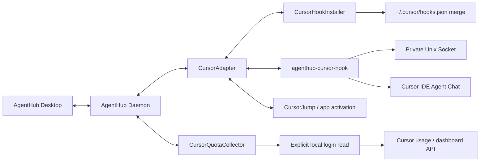

# AgentHub Hybrid Cursor Integration Design

**Status:** Approved
**Date:** 2026-08-12
**Target:** Cursor provider delivery after the Codex, OpenCode, and Claude vertical slices
**Validated against:** Cursor IDE hooks contract (docs.cursor.com/hooks) on macOS; local IDE Agent Chat only

## 1. Context

AgentHub already ships Codex, OpenCode, and Claude end to end. `Provider.cursor`
exists in the shared model, and the parent product design places Cursor at L2
discovery (hooks / local metadata) plus L3 navigation (app activation), not as a
hosted replacement for the IDE.

The user runs Cursor IDE Agent Chat locally and already has third-party hooks
installed at `~/.cursor/hooks.json` (OpenIsland). AgentHub must merge its own
entries without clobbering those hooks. The approved first Cursor slice matches
Claude's product breadth where the provider allows it: session observation,
permission handling from AgentHub, cross-provider handoff, and subscription
usage — but **without** managed session launch.

Cursor does not expose a local session-control API comparable to Codex App
Server or OpenCode HTTP. Observation and synchronous permission decisions come
from Cursor's command hooks. Jump targets degrade to activating Cursor (optionally
with a known workspace). Usage requires an explicit user authorization to read
the machine's current Cursor login session and call Cursor's usage/dashboard
APIs; there is no Claude-style status-line push of rate limits.

Official references:

- [Cursor Hooks](https://cursor.com/docs/hooks)
- [Third-party / Claude-compatible hooks](https://cursor.com/docs/reference/third-party-hooks)
- [Cursor usage limits](https://cursor.com/help/models-and-usage/usage-limits)
- Parent design: `docs/superpowers/specs/2026-08-11-agenthub-design.md`

## 2. Goals and non-goals

### Goals

- Discover local Cursor IDE Agent Chat sessions through user-level hooks the
  user installs explicitly from AgentHub.
- Normalize lifecycle, subagents, bounded recent output, and tool-permission
  requests into existing AgentHub models.
- Let the user allow or deny selected Cursor tool permissions from AgentHub
  while the hook call is still open, with safe timeout behavior.
- Jump to Cursor for a session row, preferring a known workspace root when
  hooks reported one.
- Deliver cross-provider handoffs to Cursor via clipboard-and-jump only.
- Show Cursor subscription usage windows after explicit auth-read consent,
  mapped into existing `QuotaWindow` rows.
- Preserve OpenIsland and any other pre-existing user hooks; uninstall only
  AgentHub-owned commands.
- Preserve privacy limits and isolate Cursor failures from other providers.

### Non-goals

- Launching or hosting Cursor Agent sessions from AgentHub (no managed runtime).
- Cursor Cloud Agents, Cursor CLI / terminal agents, or Tab-completion hooks.
- Automatically pasting or submitting handoff text into Cursor.
- Best-effort Accessibility clicking to select a specific chat when the match
  is ambiguous.
- Estimating usage from local transcripts or token counters when the dashboard
  API is unavailable.
- Silently reading Cursor credentials without an explicit authorize action.
- Persisting Cursor access tokens in AgentHub SQLite, Keychain, logs, or IPC
  snapshots.
- Replacing Cursor's native permission UI as the only path (timeout must fall
  back to Cursor's own `ask` flow).

## 3. Selected architecture



### CursorHookInstaller

Owns only AgentHub entries in the user-level `~/.cursor/hooks.json` (schema
`version: 1`). It parses the existing JSON, merges hook commands with absolute
paths into a copy, validates the result, and atomically replaces the file.
Existing hooks (including OpenIsland), unknown keys, and formatting-independent
values are preserved. Reinstall is idempotent: prior AgentHub commands for the
same events are removed before appending one fresh entry each. Uninstall removes
only commands whose normalized executable path equals AgentHub's helper.

Project-level `.cursor/hooks.json` files are out of scope for automatic install;
AgentHub documents that project hooks remain the user's responsibility.

### agenthub-cursor-hook

A small executable packaged beside the daemon. Cursor invokes it with JSON on
stdin. The bridge:

1. validates event name and payload size;
2. records bounded current-user process ancestry (no environment dump);
3. sends a `ProviderHookEnvelope` for `.cursor` over the private Unix socket;
4. for **decision** events, waits on the daemon for an allow/deny tied to the
   request id;
5. prints the Cursor hook JSON response on stdout and exits.

Observation-only events return quickly (empty/`{}` or continue-true as required
by the event). If the daemon is down, decision hooks return
`{ "permission": "ask" }` (or the event's equivalent non-allowing fallback) so
Cursor's native UI remains authoritative. The bridge never default-allows.

### CursorAdapter

Implements `AgentAdapter`, `HookEventIngestingAdapter`, and
`ProviderConfigurableAdapter`. It normalizes IDE observations into
`AgentSession`, `AgentNode`, `PendingRequest`, capability, health, and handoff
abstractions. Provider-specific payloads stay behind the adapter boundary.

Canonical identity:

```text
provider = cursor
account = local-default or resolved Cursor account label when safely available
nativeID = conversation_id (session_id when present; same stable chat id)
surface = ide
```

Deduplication key within an account is exact `conversation_id`. Workspace root
lists from hooks are metadata for jump hints, not identity.

There is no managed launch path and no `ClaudeTerminalRuntime` equivalent.
`launch` returns a clear unsupported/degraded error; the UI does not offer a
primary "New Cursor session" action in this slice.

### CursorQuotaCollector

Separate from hook setup. After the user explicitly authorizes usage reading,
the collector reads the current Cursor login material from local application
support state **into process memory only**, calls the locked-down usage /
dashboard endpoints chosen during implementation (validated against a live
logged-in machine), and maps results into `QuotaWindow` rows with
`source = cursor-dashboard`.

Authorization is a dedicated configure action, revocable at any time. Revocation
stops collection, drops in-memory credentials, removes Cursor `QuotaWindow`
rows from the published snapshot, and sets the quota component to unavailable.

## 4. Permission synchronization

Cursor tool gates such as `beforeShellExecution` and `beforeMCPExecution` expect
a synchronous `permission` of `allow` | `deny` | `ask` on the same hook
invocation. Unlike Claude's async `PermissionRequest` observer, AgentHub must
decide before the hook returns.

Flow:

1. Bridge receives a decision event and forwards it with a fresh `requestID`.
2. Adapter creates a `PendingRequest` with `conversation_id`, `generation_id`
   when present, tool kind, and a **bounded preview** of the command or tool
   name. Full shell strings and full MCP JSON inputs are not persisted.
3. Bridge blocks waiting for the daemon decision. Default wait budget is about
   **25 seconds**, below typical Cursor hook timeouts and configurable in one
   place.
4. The user resolves the request in AgentHub. Before applying the decision, the
   adapter revalidates that the same `conversation_id`, `generation_id`, and
   request fingerprint are still current. Mismatch → treat as failure and respond
   `ask`.
5. Bridge writes `{ "permission": "allow" | "deny" }` and exits.
6. On timeout, daemon disconnect, or validation failure, bridge responds
   `{ "permission": "ask" }` and the pending request is marked expired/degraded
   with copy that the user should confirm in Cursor. **Never default to allow.**

`preToolUse` may be included when its payload and response contract are stable
in the validated Cursor version; otherwise the first slice limits decision hooks
to shell and MCP. Observation hooks still include lifecycle and subagent events
listed below.

AgentHub does not rewrite or suppress outputs from other hooks on the same
event. OpenIsland entries remain registered beside AgentHub entries.

## 5. Session lifecycle, jump, and handoff

### Discovery and liveness

Hooks are the live signal. A transcript path alone never proves a session is
running. Running/working requires a recent hook event for that `conversation_id`
(and, when useful, still-observable Cursor processes for the current user).

Events used by the first slice (names per Cursor docs):

- Lifecycle: `sessionStart`, `sessionEnd`, `beforeSubmitPrompt`, `stop`
- Observation: `afterAgentResponse`, `afterAgentThought` (bounded; no full
  transcript persistence), `preCompact` (optional, observe-only)
- Tools: `beforeShellExecution`, `afterShellExecution`, `beforeMCPExecution`,
  `afterMCPExecution`, and observe-only `afterFileEdit` / `beforeReadFile` as
  needed for activity — without turning every file read into a user-facing
  request
- Subagents: `subagentStart`, `subagentStop`

Unknown events and fields are ignored without disabling known behavior.

State mapping (normalized):

- `sessionStart` → create/reconnect as `starting` or `idle`
- `beforeSubmitPrompt` / active tool observation → `working`
- Decision hook waiting on AgentHub → `waiting_permission`
- `stop` → `idle`
- `sessionEnd` → `completed` or `disconnected` per payload
- Subagent start/stop → `AgentNode` upserts; missing parentage stays
  "relationship unknown"

### Jump

Clicking a Cursor row activates the Cursor application. When
`workspace_roots` (or equivalent) were observed for that conversation, AgentHub
attempts to open that folder via the Cursor CLI or `open -a Cursor`. If the
exact chat cannot be verified, AgentHub stops after activation/workspace open
and explains that precise session navigation was unavailable. It never reports
an exact jump after a fallback, and it never best-effort clicks chat rows in the
UI.

### Handoff

Because this slice has no managed input channel into Cursor, delivery is
**clipboard-and-jump only**. AgentHub does not auto-paste or submit. Inbound
direct injection into an idle Cursor chat is deferred until a verified input
path exists.

## 6. Quota authorization and mapping

- Setup UI separates **Install Hooks** from **Authorize Usage Reading**.
- First authorize action shows a clear disclosure: AgentHub will read the local
  Cursor login session to query usage, only on this machine, and will not store
  the token in AgentHub's database.
- Successful reads populate one or more `QuotaWindow` values (for example
  included pool and on-demand / spending percentage windows) with `resetsAt`
  when the API provides a billing-cycle end; otherwise the window is omitted
  rather than inventing a reset.
- Polling uses a bounded interval and backoff. HTTP 401, missing login, or
  schema drift mark the quota component unavailable and keep the last successful
  reading visible but stale (same freshness rules as other providers). Revoke
  always clears Cursor windows as specified in §3.
- No silent Homebrew/cask install; no third-party quota helper binary.

Implementation must pin the concrete local auth artifact path(s) and API
request shapes in the plan after a live probe on the developer's machine, and
must add a regression test that fails if token material appears in encoded
snapshots or logs.

## 7. Privacy and safety

- Raw hook JSON, full prompts, full tool inputs, and environment blocks are not
  persisted. Only normalized sessions, bounded previews, and request metadata
  enter SQLite.
- Cursor access tokens exist only in daemon memory while authorization is on.
- Default tests never modify the real `~/.cursor/hooks.json`, never read real
  Cursor auth, never launch Cursor UI automation, and never call the live usage
  API.
- Permission path never auto-approves; timeout and errors degrade to `ask`.
- Cursor adapter failures must not take down Codex, OpenCode, or Claude.

## 8. Testing strategy

- Fixture payloads for each supported hook event under `Tests/Fixtures/Cursor/`.
- Installer tests: merge beside OpenIsland-like entries; uninstall leaves them.
- Permission tests: allow/deny happy path; timeout → `ask`; fingerprint mismatch
  → `ask`; daemon down → `ask`.
- Adapter vertical slice through Unix socket (mirror Claude/OpenCode patterns).
- Quota unit tests with recorded HTTP fixtures; assert tokens never enter
  `AgentHubState` encodings.
- Opt-in live flags, separate from the default gate:
  - hook smoke against a temporary hooks file / or documented manual install;
  - `AGENTHUB_LIVE_CURSOR_QUOTA=1` only after authorize semantics are exercised
    in a controlled way (still must not print tokens).

## 9. UI and configuration actions

Cursor Settings (parallel to Claude Settings) exposes component health for:

- `hooks` — installed / missing helper
- `quota` — unauthorized / authorized / unavailable

`ProviderConfigurationAction` usage:

- `installHooks` / `uninstallHooks`
- quota authorize / revoke as dedicated actions (extend the enum if existing
  `installQuotaReporter` naming is Claude-specific; prefer clear Cursor-named
  actions or documented reuse without implying a status-line reporter)

Dashboard lists discovered Cursor sessions in the shared tree, shows pending
Cursor permission requests in the unified inbox, and renders Cursor quota in the
shared strip when windows exist.

## 10. Delivery boundaries

In scope for the implementation plan that follows this spec:

1. Package, hook bridge, installer, adapter, daemon wiring, IPC/fixtures/tests.
2. Sync permission requests and resolutions.
3. Jump activation with workspace hint.
4. Clipboard-and-jump handoff participation.
5. Explicit quota authorize + collector + UI.

Explicitly deferred:

- Managed Cursor launch and direct input injection.
- Cloud Agents and CLI agents.
- Exact in-IDE chat selection via Accessibility.
- Enterprise Admin API as the default personal quota path.
